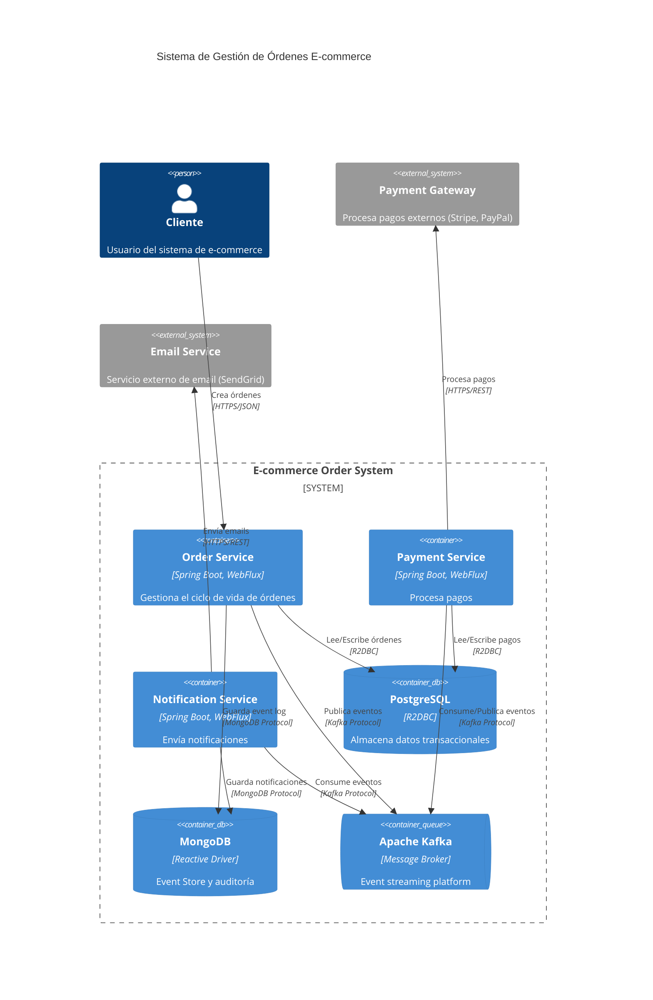
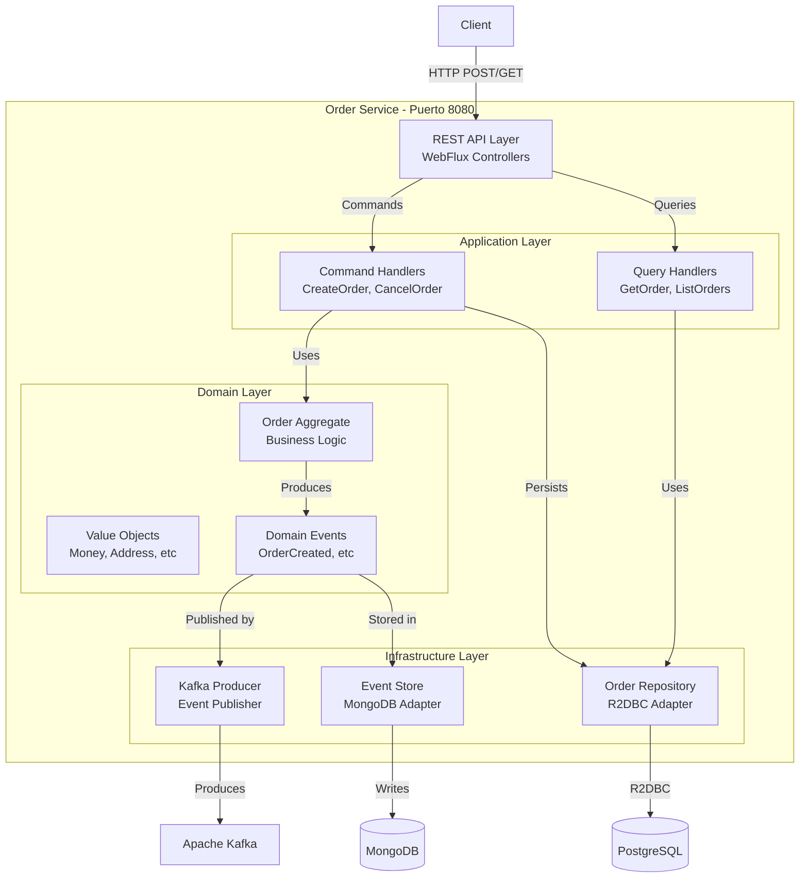
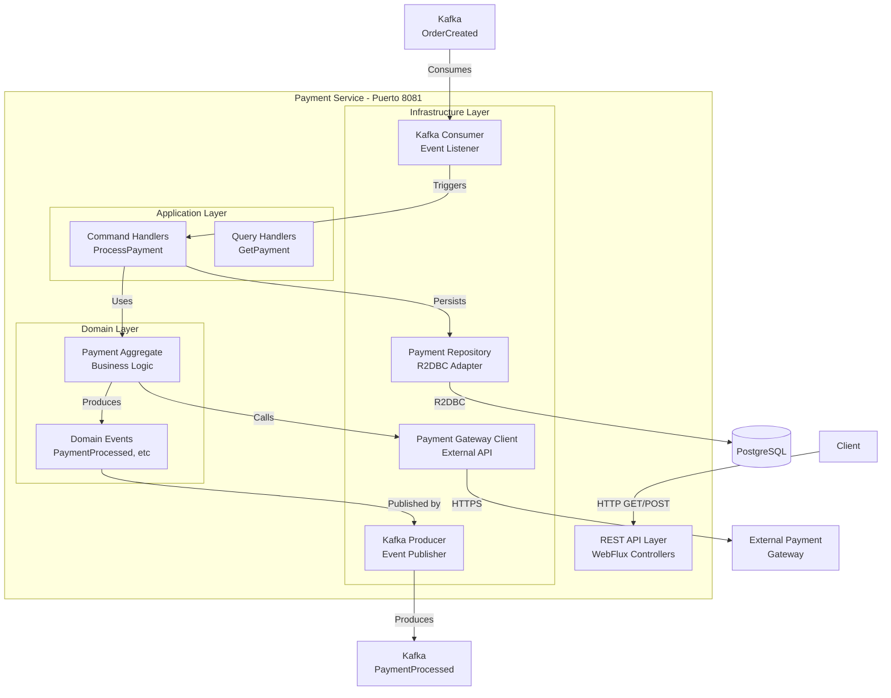
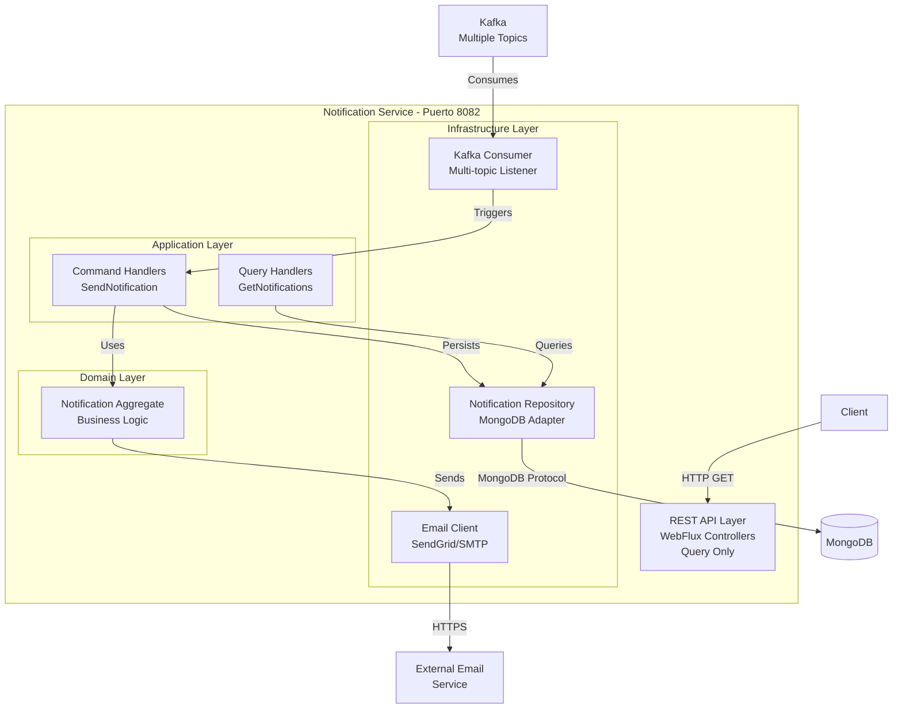
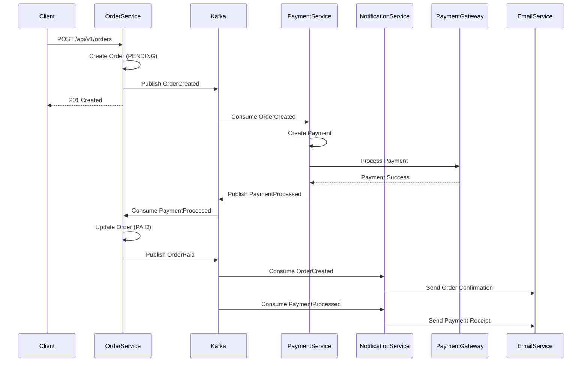
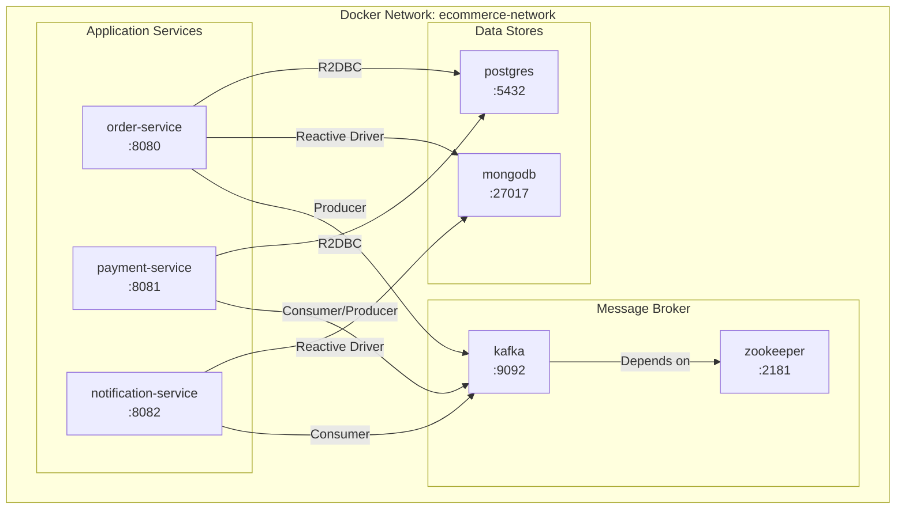
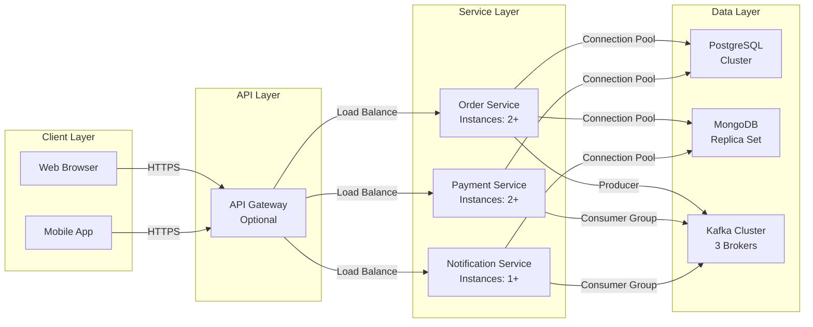

# Diagrama C4 - Nivel de Componentes

Este documento muestra la arquitectura del sistema usando el modelo C4. Si no estás familiarizado con C4, es básicamente una forma de visualizar arquitectura en diferentes niveles de zoom: Context → Containers → Components → Code. Aquí nos enfocamos en Containers y Components.

Por qué C4? Porque después de intentar explicar la arquitectura con diagramas UML tradicionales y ver caras confundidas, encontré que C4 es más intuitivo. La gente lo entiende rápido.

## Vista General del Sistema

---

## Nivel de Contenedores - Order Service

Aquí viene lo interesante. Voy a desglosar cada servicio mostrando su estructura interna según Clean Architecture (ver ADR-001).

La clave aquí es que TODOS los servicios siguen la misma estructura. Order Service, Payment Service, Notification Service... todos tienen las mismas capas. Esto no es coincidencia, es intencional. Cuando saltas de un servicio a otro, sabes exactamente dónde encontrar las cosas.

---

## Nivel de Contenedores - Payment Service

---

## Nivel de Contenedores - Notification Service

---

## Flujo de Comunicación Entre Servicios

Este diagrama de secuencia muestra el happy path completo. En producción vas a ver variaciones (pagos que fallan, timeouts, etc), pero este es el flujo ideal que queremos que pase el 95% del tiempo.

Fíjate cómo todo es asíncrono excepto la interacción inicial del cliente. El usuario hace POST, recibe 201 Created inmediatamente, y el resto pasa en background. Esto es crítico para UX - el usuario no espera 30 segundos a que se procese el pago.

---

## Infraestructura - Docker Compose

Esto es cómo corre todo localmente en desarrollo. En producción tendrías clusters de Kubernetes o similar, pero el concepto es el mismo: servicios independientes comunicándose vía red.

La red `ecommerce-network` es importante. Todos los containers están en la misma red Docker, lo que significa que pueden hablarse por nombre (postgres:5432, kafka:9092). Sin esto, tendrías que exponer puertos y usar localhost, que es más frágil.

---

## Despliegue de Componentes

Esta es la visión de producción. Nota las diferencias clave vs desarrollo:

- **Múltiples instancias de cada servicio** (alta disponibilidad + escalabilidad)
- **Clusters de bases de datos** (no single points of failure)
- **API Gateway opcional** (podríamos usar uno, o exponer servicios directamente)

El número de instancias (2+ para Orders/Payments, 1+ para Notifications) no es arbitrario. Orders y Payments son críticos - necesitan redundancia. Notifications es menos crítico, puede correr con una instancia (aunque en producción real probablemente tendrías 2 también).

---

## Notas de Arquitectura

### Principios Aplicados

**Clean Architecture (ver ADR-001):**
- Cada servicio tiene capas claramente definidas (Domain, Application, Infrastructure)
- Las dependencias apuntan hacia adentro (Infrastructure → Application → Domain)
- El dominio no conoce detalles de infraestructura

Esto nos costó código extra (interfaces, adapters, mappers), pero vale la pena. Cambiar de PostgreSQL a MySQL? Solo tocas Infrastructure. Cambiar lógica de negocio? Solo tocas Domain. El aislamiento es real.

**Event-Driven (ver ADR-002):**
- Comunicación asíncrona vía Kafka
- Servicios desacoplados temporalmente
- Event Sourcing en MongoDB para auditoría

La parte de Event Sourcing es especialmente poderosa. Cada cambio en el sistema está registrado como evento en MongoDB. Puedes reconstruir el estado de cualquier orden en cualquier momento histórico. Debugging se vuelve arqueología: "qué pasó con esta orden el martes pasado a las 3pm?" → miras los eventos, ahí está todo.

**Programación Reactiva:**
- Spring WebFlux (non-blocking I/O)
- R2DBC para acceso reactivo a PostgreSQL
- MongoDB Reactive Driver

Reactive no es solo buzz. Con WebFlux, un thread puede manejar miles de requests concurrentes (vs ~200 con threads tradicionales). Esto es crítico para órdenes - esperamos picos de tráfico en promociones.

**Escalabilidad:**
- Servicios stateless (pueden escalar horizontalmente)
- Kafka permite paralelización con particiones
- Bases de datos pueden clusterizarse

Stateless es la clave. No hay sesiones en memoria, no hay caches locales. Puedes agregar una instancia de Order Service en cualquier momento y funciona. Kubernetes puede hacer autoscaling sin que te enteres.

### Patrones de Integración

**Choreography-based Saga (ver ADR-003):**
- No hay orquestador central
- Cada servicio reacciona a eventos de forma autónoma
- Compensaciones manejadas por eventos (OrderCancelled, PaymentFailed)

Choreography vs Orchestration fue una decisión difícil. Choreography es más resiliente pero más difícil de razonar. Para nuestro flujo (relativamente simple), vale la pena.

**CQRS (Command Query Responsibility Segregation):**
- Separación de Commands y Queries
- Commands modifican estado y publican eventos
- Queries solo leen datos

CQRS no es solo un patrón fancy. Nos permite optimizar reads y writes independientemente. Podríamos tener una read database (MongoDB) optimizada para queries complejas, y una write database (PostgreSQL) optimizada para transacciones. No lo hacemos aún, pero la arquitectura lo permite.

**Event Sourcing:**
- Eventos almacenados en MongoDB
- Permite reconstruir estado histórico
- Auditoría completa del sistema

Esto nos salvó en un bug de producción real: un pago se procesó dos veces. Pudimos rastrear EXACTAMENTE qué pasó mirando los eventos. Sin Event Sourcing, hubiera sido un misterio.
