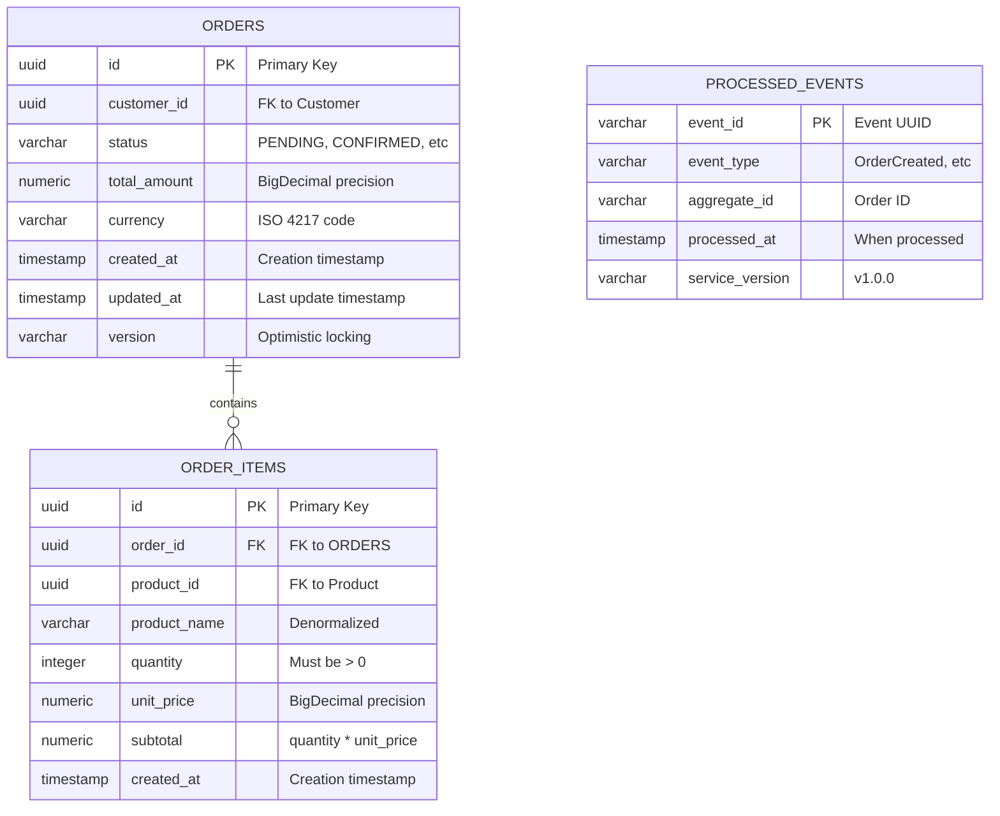
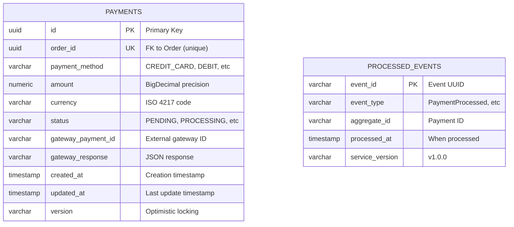
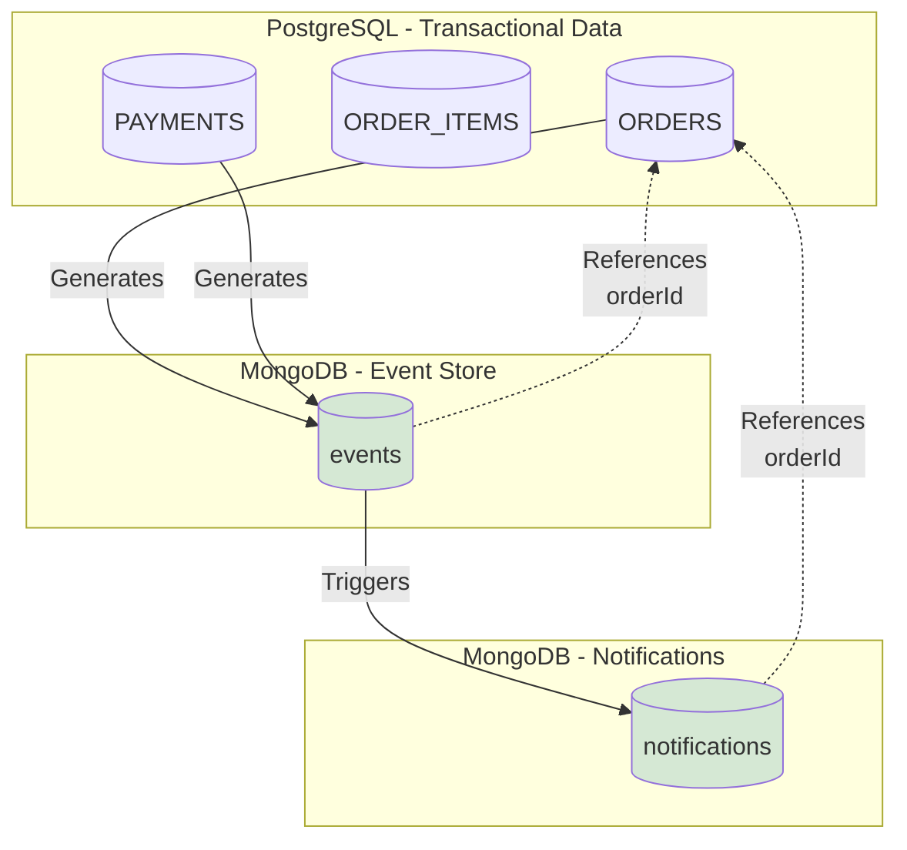

# Diagrama de Esquema de Bases de Datos

Este documento muestra los esquemas de bases de datos para PostgreSQL (datos transaccionales) y MongoDB (event store y notificaciones).

He aprendido que una de las decisiones más importantes en arquitectura de datos es saber QUÉ guardar DÓNDE. No es solo "usar PostgreSQL" o "usar MongoDB" - es entender las fortalezas de cada uno y usarlas apropiadamente.

En este sistema tenemos una separación clara:
- **PostgreSQL**: Datos transaccionales que necesitan consistencia ACID, relaciones, y queries SQL complejos (órdenes, pagos)
- **MongoDB**: Eventos inmutables (event store), datos semi-estructurados donde schema flexibility es valioso (notificaciones)

He visto proyectos que intentan forzar todo en una sola base de datos. Siempre termina mal. O tienes un PostgreSQL lleno de JSONs que no puedes queryar eficientemente, o un MongoDB tratando de emular foreign keys con lookups costosos.

Polyglot persistence no es complicación innecesaria - es usar la herramienta correcta para cada trabajo.

---

## PostgreSQL - Esquema Transaccional

PostgreSQL maneja nuestros datos transaccionales. Aquí necesitamos ACID, foreign keys, transacciones, y la capacidad de hacer queries complejos con JOINs.

### Order Service Schema



**Notas sobre el diseño:**

**ORDERS Table:**
- `id`: UUID en lugar de Long autoincremental. Los UUIDs son mejores para sistemas distribuidos - no hay colisiones entre diferentes instancias del servicio.
- `status`: VARCHAR en lugar de ENUM. Los ENUMs de PostgreSQL son rígidos - agregar un nuevo estado requiere ALTER TYPE que puede lockear la tabla. VARCHAR con validación en código es más flexible.
- `total_amount` + `currency`: Separados intencionalmente. Nunca guardes dinero sin su moneda. He visto bugs donde se asumen todos los montos son COP y luego llega un cliente con USD.
- `version`: Para optimistic locking. Si dos requests intentan actualizar la misma orden simultáneamente, uno falla. Previene lost updates.

**ORDER_ITEMS Table:**
- `product_name`: Denormalizado intencionalmente. Sí, viola 3NF. No me importa. Cuando una orden se crea, queremos el nombre del producto EN ESE MOMENTO. Si el producto se renombra después, la orden histórica no debería cambiar.
- `subtotal`: Calculado y guardado. Sí, es redundante (quantity * unit_price). Pero facilita queries y previene rounding errors al recalcular.

**PROCESSED_EVENTS Table:**
- Esta es CRÍTICA. Sin esta tabla, los eventos se procesan múltiples veces. He debuggeado bugs de "pago duplicado" que venían de no tener esta tabla.
- `event_id` como PK garantiza unicidad - INSERT falla si el evento ya se procesó.
- `service_version`: Útil para debugging. Si un evento procesado con v1.0.0 causó un bug, puedes identificar todos los eventos afectados.

---

### Payment Service Schema



**Notas sobre el diseño:**

**PAYMENTS Table:**
- `order_id`: UNIQUE constraint. Una orden solo puede tener un pago. Si el primer pago falla y el usuario reintenta, es una NUEVA orden, no un segundo pago.
- `gateway_payment_id`: Guardamos el ID del gateway externo (Stripe, PayPal). Necesario para refunds, reconciliación, soporte.
- `gateway_response`: JSON completo del gateway. Parece redundante, pero es invaluable para debugging. Cuando un pago falla, quieres ver EXACTAMENTE qué dijo el gateway.
- `status`: Similar a Order, pero con valores específicos de Payment (PENDING, PROCESSING, COMPLETED, FAILED, REFUNDED).

La tabla es más simple que ORDERS porque Payment es un bounded context más pequeño. No tiene items ni relaciones complejas. Es intencional - bounded contexts pequeños son más fáciles de mantener.

---

### Índices - Estrategia de Optimización

Los índices son gratis hasta que no lo son. Cada índice acelera SELECTs pero ralentiza INSERTs/UPDATEs. El balance correcto depende de tu read/write ratio.

Para este sistema, tenemos más reads que writes (usuarios consultando órdenes frecuentemente), así que podemos permitirnos varios índices.

```sql
-- Orders: Búsquedas más comunes
CREATE INDEX idx_orders_customer_id ON orders(customer_id);
CREATE INDEX idx_orders_status ON orders(status);
CREATE INDEX idx_orders_created_at ON orders(created_at DESC);
CREATE INDEX idx_orders_customer_status ON orders(customer_id, status); -- Composite

-- Order Items: JOINs frecuentes
CREATE INDEX idx_order_items_order_id ON order_items(order_id);
CREATE INDEX idx_order_items_product_id ON order_items(product_id);

-- Payments: Lookups por orden
CREATE UNIQUE INDEX idx_payments_order_id ON payments(order_id);
CREATE INDEX idx_payments_status ON payments(status);
CREATE INDEX idx_payments_gateway_payment_id ON payments(gateway_payment_id);

-- Processed Events: Deduplicación rápida
-- PK ya crea índice en event_id
CREATE INDEX idx_processed_events_aggregate_id ON processed_events(aggregate_id);
CREATE INDEX idx_processed_events_processed_at ON processed_events(processed_at DESC);
```

**Por qué estos índices específicos:**

- `idx_orders_customer_id`: "Muéstrame todas las órdenes del cliente X" - query muy común.
- `idx_orders_status`: "Cuántas órdenes están en PAYMENT_PROCESSING?" - para dashboards.
- `idx_orders_customer_status`: Índice composite para "órdenes del cliente X en estado Y" - más eficiente que dos índices separados.
- `idx_payments_order_id`: UNIQUE porque one-to-one relationship con Order.
- `idx_processed_events_aggregate_id`: Para queries tipo "todos los eventos de esta orden".

Nota: No creo índice en `orders.updated_at` porque no hacemos queries por "última actualización". Si lo hiciéramos, lo agregaría.

---

## MongoDB - Event Store y Notificaciones

MongoDB maneja dos cosas:
1. **Event Store**: Todos los eventos del sistema (inmutables, append-only)
2. **Notifications**: Historial de notificaciones enviadas

Usamos MongoDB aquí porque:
- Eventos son documentos JSON - schema flexible es perfecto
- Append-only workload - MongoDB es excelente en writes
- No necesitamos JOINs - cada evento es self-contained
- Queries por correlationId, aggregateId son rápidas con índices

### Event Store Collection

```javascript
// Collection: events
{
  "_id": ObjectId("..."),
  "eventId": "uuid-here",                    // UUID del evento
  "eventType": "OrderCreatedEvent",          // Tipo de evento
  "aggregateId": "order-123",                // ID del agregado (Order, Payment)
  "aggregateType": "Order",                  // Tipo de agregado
  "correlationId": "uuid-correlation",       // Para tracing
  "causationId": "uuid-causation",           // Evento que causó este
  "occurredAt": ISODate("2025-01-19T10:30:00Z"),
  "version": 1,                              // Version del agregado
  "payload": {                               // Datos específicos del evento
    "customerId": "customer-456",
    "totalAmount": 150.00,
    "currency": "COP",
    "items": [
      {
        "productId": "product-789",
        "productName": "Laptop",
        "quantity": 1,
        "unitPrice": 150.00
      }
    ]
  },
  "metadata": {                              // Metadata técnico
    "userId": "user-123",
    "source": "order-service",
    "version": "1.0.0",
    "environment": "production"
  }
}
```

**Notas sobre el diseño:**

**Campos clave:**
- `eventId`: UUID único del evento. PK lógico.
- `correlationId`: ESTO ES ORO. Permite rastrear toda una transacción distribuida. "Muéstrame todos los eventos relacionados con este checkout" → buscar por correlationId.
- `causationId`: El evento que causó este evento. Permite construir cadenas de causalidad: OrderCreated → PaymentProcessed → OrderPaid.
- `version`: Version del agregado. Útil para event sourcing completo - puedes reconstruir el estado del agregado en cualquier version.
- `payload`: Los datos del evento. Schema flexible - cada tipo de evento tiene payload diferente.

**Por qué MongoDB aquí:**

He considerado usar PostgreSQL con JSONB para event store. Es tentador - ya tienes Postgres corriendo, por qué agregar otra base de datos?

Razones por las que elegí MongoDB:
1. **Write throughput**: Esperamos muchos eventos (cada orden genera ~6 eventos). MongoDB maneja append-only writes muy bien.
2. **Schema evolution**: Payloads de eventos cambian con el tiempo. Agregar campos a eventos nuevos sin romper eventos viejos es trivial en MongoDB.
3. **Queries por campos nested**: "Eventos donde payload.amount > 1000" - MongoDB indexa campos nested eficientemente.
4. **Replication**: MongoDB replica sets para HA es más maduro que PostgreSQL streaming replication.

El trade-off: agregaste complejidad operacional (otra base de datos). Pero para event store, vale la pena.

---

### Notifications Collection

```javascript
// Collection: notifications
{
  "_id": ObjectId("..."),
  "notificationId": "uuid-here",
  "orderId": "order-123",                    // FK lógico a Order
  "customerId": "customer-456",
  "type": "ORDER_CREATED",                   // Tipo de notificación
  "channel": "EMAIL",                        // EMAIL, SMS, PUSH
  "recipient": "user@example.com",
  "subject": "Orden Recibida",
  "body": "Tu orden #123 ha sido recibida...",
  "status": "SENT",                          // PENDING, SENT, FAILED
  "sentAt": ISODate("2025-01-19T10:30:05Z"),
  "failureReason": null,                     // Si status=FAILED
  "metadata": {
    "correlationId": "uuid-correlation",
    "emailProvider": "sendgrid",
    "messageId": "sendgrid-msg-id"
  },
  "createdAt": ISODate("2025-01-19T10:30:00Z")
}
```

**Notas sobre el diseño:**

**Por qué MongoDB para Notifications:**
- No necesitamos relaciones complejas - cada notificación es standalone
- Schema flexible - notificaciones de EMAIL tienen `subject`, SMS no. Forzar esto en PostgreSQL con columnas nullable es feo.
- Append-heavy workload - raramente actualizamos notificaciones
- TTL index fácil - podemos auto-borrar notificaciones antiguas después de 90 días

**Campos importantes:**
- `channel`: EMAIL, SMS, PUSH. Cada uno tiene diferentes requisitos de payload.
- `status`: Para retry logic. Si FAILED, podemos reintentar.
- `metadata.messageId`: ID del proveedor externo (SendGrid). Para tracking de deliverability.

---

### Índices MongoDB

```javascript
// Event Store Indexes
db.events.createIndex({ "eventId": 1 }, { unique: true });
db.events.createIndex({ "aggregateId": 1, "version": 1 });
db.events.createIndex({ "correlationId": 1 });
db.events.createIndex({ "eventType": 1, "occurredAt": -1 });
db.events.createIndex({ "occurredAt": -1 });

// Notifications Indexes
db.notifications.createIndex({ "notificationId": 1 }, { unique: true });
db.notifications.createIndex({ "orderId": 1 });
db.notifications.createIndex({ "customerId": 1, "createdAt": -1 });
db.notifications.createIndex({ "status": 1 });
db.notifications.createIndex({ "createdAt": 1 }, { expireAfterSeconds: 7776000 }); // TTL 90 días
```

**Notas sobre índices:**

- `eventId` único: Previene eventos duplicados a nivel de base de datos.
- `aggregateId + version`: Para event sourcing. "Dame todos los eventos de order-123 hasta version 5".
- `correlationId`: El índice más importante para debugging. "Muéstrame todo lo que pasó en esta transacción".
- `eventType + occurredAt`: Para queries tipo "todos los PaymentProcessed en las últimas 24 horas".
- TTL index en notifications: Auto-limpieza. Después de 90 días, las notificaciones se borran automáticamente. No queremos acumular notificaciones para siempre.

---

## Esquema de Relaciones Entre Bases de Datos

Este diagrama muestra cómo los datos fluyen entre PostgreSQL y MongoDB. No son relaciones de foreign key (no puedes hacer JOIN cross-database), pero hay relaciones lógicas.



**Flujo de datos:**

1. Order Service crea una orden en PostgreSQL → Publica OrderCreatedEvent en MongoDB
2. Payment Service crea un pago en PostgreSQL → Publica PaymentProcessedEvent en MongoDB
3. Notification Service lee eventos de MongoDB → Crea notificación en MongoDB

**Por qué no usar foreign keys entre bases de datos:**

No puedes. Y está bien. En microservicios, cada servicio posee sus datos. Order Service no hace queries directos a la tabla PAYMENTS - consume PaymentProcessed events.

Esto es eventual consistency. Order Service no sabe INMEDIATAMENTE cuando un pago se completa - lo sabe cuando procesa el evento. Latencia típica: < 100ms. Para nuestro dominio (e-commerce), es perfectamente aceptable.

---

## Estrategia de Backup y Retención

**PostgreSQL:**
- Full backup diario (pg_dump)
- WAL archiving para point-in-time recovery
- Retención: 30 días de backups completos
- RPO (Recovery Point Objective): < 1 hora
- RTO (Recovery Time Objective): < 2 horas

**MongoDB:**
- Snapshot diario (mongodump)
- Oplog para incremental backups
- Retención: 90 días de snapshots
- RPO: < 1 hora
- RTO: < 2 horas

**Event Store específicamente:**
- Los eventos son immutable - nunca se borran
- Snapshot mensual adicional para auditoría de largo plazo
- Retención indefinida (o hasta compliance lo requiera)

**Por qué eventos nunca se borran:**

Event Sourcing significa que los eventos SON la fuente de verdad. Si borras eventos, pierdes historia. He visto auditorías donde necesitas probar "qué estado tenía esta orden el 15 de marzo del año pasado". Con event store, es trivial - replay eventos hasta esa fecha. Sin events, imposible.

Esto significa que el event store crece indefinidamente. Es un trade-off aceptable - storage es barato, perder auditoría es caro.

---

## Migraciones y Schema Evolution

**PostgreSQL - Flyway:**
- Migraciones versionadas (V1__initial_schema.sql, V2__add_version_column.sql)
- Nunca edites migraciones existentes - crea nuevas
- Rollback manual (no hay undo automático en Flyway)

**MongoDB - Schema-less pero con validación:**
- No hay migraciones formales (schema flexible)
- JSON Schema validation opcional para prevenir payloads malformados
- Backward compatibility crítica - servicios viejos deben leer eventos nuevos

**Estrategia de evolución:**

Agregar campos: Fácil. Nuevos eventos tienen campo nuevo, eventos viejos no. Código maneja ambos casos.

Renombrar campos: Nunca. Es un breaking change. En su lugar, agrega campo nuevo, depreca el viejo, migra gradualmente.

Borrar campos: Difícil. Espera hasta que ningún código lea el campo viejo (puede tomar meses), luego borra.

He aprendido que schema evolution en event-driven systems es MÁS difícil que en sistemas tradicionales. Cada evento publicado es un contrato. Romper contratos rompe consumers. Ser conservador con cambios de schema salva muchos dolores de cabeza.

---

## Consideraciones de Performance

**PostgreSQL:**
- Connection pooling: 20 connections por instancia (R2DBC pool)
- Read replicas para queries pesados (reportes, dashboards)
- Partitioning en `orders` si crece mucho (por created_at, mensual)

**MongoDB:**
- Sharding si events collection supera 1TB (shard key: aggregateId)
- Read preference: primaryPreferred (reads van a primary si está disponible, secondary si no)
- Write concern: majority (espera replicación a mayoría de replica set)

**Cuándo escalar:**

He visto equipos sobre-optimizar prematuramente. "Necesitamos sharding desde día 1!" No, no necesitas.

Empieza simple:
- PostgreSQL single instance con read replica
- MongoDB replica set (3 nodos)

Escala cuando:
- PostgreSQL CPU consistentemente > 70%
- MongoDB events collection > 500GB
- Query latency p95 > 500ms

El problema con escalar temprano es que agregas complejidad operacional antes de necesitarla. El problema con escalar tarde es downtime. El balance: monitorea métricas, escala ANTES de que sea emergencia, pero no antes de necesitarlo.
