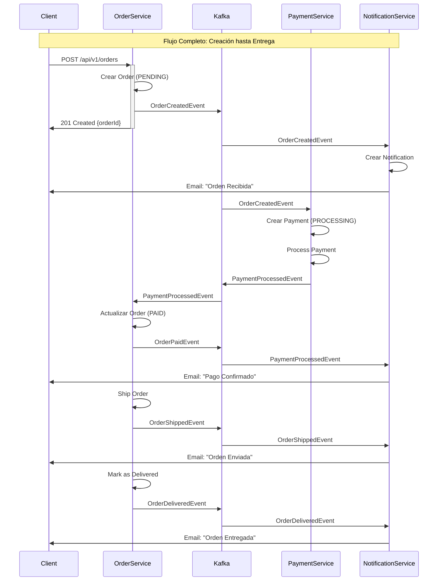
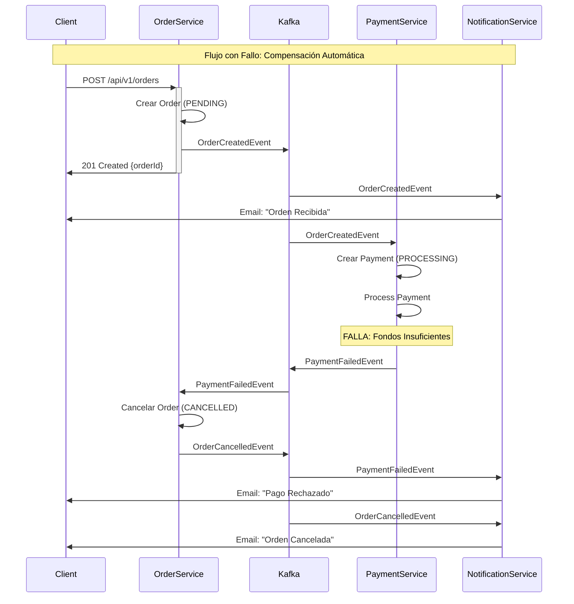
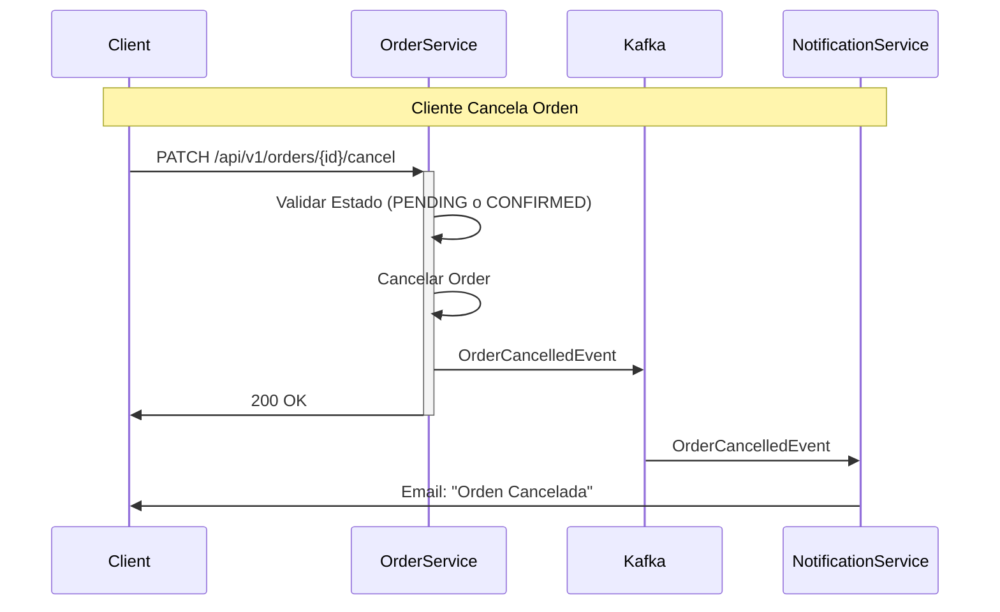
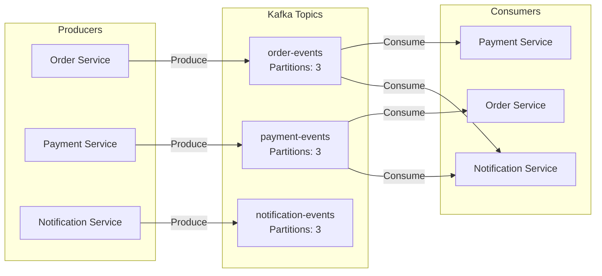
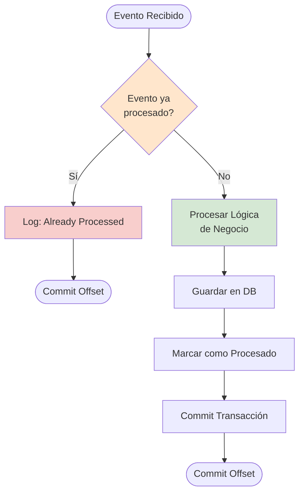
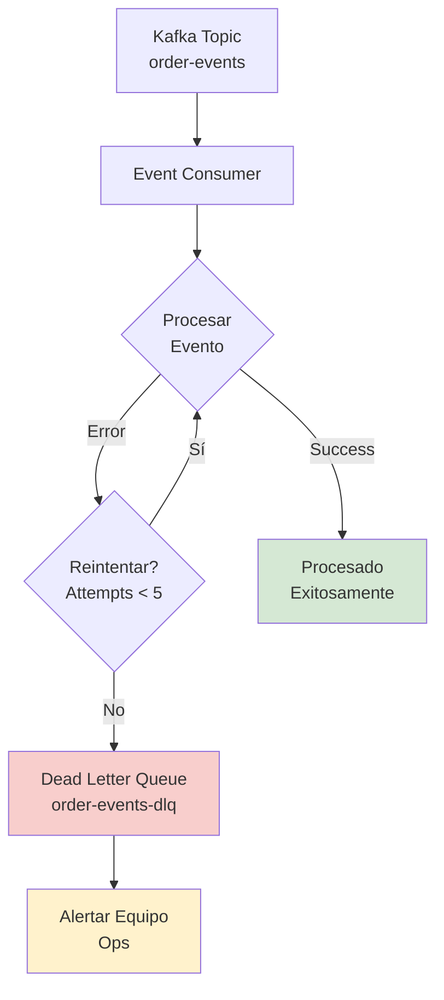

# Diagrama de Flujo de Eventos Entre Servicios

Este documento es crítico. Aquí está TODO el flujo de eventos del sistema. Si alguien pregunta "cómo funciona el sistema de órdenes?", muéstrales esto.

He dividido los flujos en escenarios: happy path (todo sale bien), compensación (algo falla), cancelación manual. En producción vas a ver una mezcla de los tres, pero entender cada uno por separado ayuda.

## Flujo Happy Path - Orden Exitosa

Este es el flujo ideal. El que queremos que pase el 95%+ del tiempo. Usuario compra, pagamos, notificamos, enviamos, todos felices.



---

## Flujo de Compensación - Pago Falla

Aquí es donde se pone interesante. Este es el flujo de Saga con compensación (ver ADR-003).

Cuando el pago falla, no podemos hacer "rollback" como en una transacción de base de datos. Cada servicio ya hizo su parte. Entonces necesitamos COMPENSAR: deshacer lo que ya hicimos.

En este caso: cancelar la orden, liberar inventario (si lo reservamos), notificar al usuario del problema. Es eventual consistency en acción.



---

## Flujo de Cancelación Manual



---

## Mapa de Eventos por Servicio

Esta tabla es tu referencia rápida. Si te preguntas "qué eventos publica Payment Service?" o "quién consume OrderCreated?", aquí está.

La mantenemos actualizada porque en sistemas event-driven, perder track de quién publica/consume qué es fácil. Esta es tu mapa.

### Order Service

**Publica:**
- `OrderCreatedEvent` (cuando se crea una orden)
- `OrderConfirmedEvent` (cuando se confirma inventario/validaciones)
- `OrderPaidEvent` (cuando recibe PaymentProcessedEvent)
- `OrderShippedEvent` (cuando se envía físicamente)
- `OrderDeliveredEvent` (cuando se confirma entrega)
- `OrderCancelledEvent` (cancelación manual o por compensación)
- `OrderFailedEvent` (error irrecuperable)

**Consume:**
- `PaymentProcessedEvent` → Actualiza orden a PAID
- `PaymentFailedEvent` → Cancela orden (compensación)

---

### Payment Service

**Publica:**
- `PaymentProcessedEvent`
- `PaymentFailedEvent`

**Consume:**
- `OrderCreatedEvent` → Inicia procesamiento de pago
- `OrderCancelledEvent` → Marca payment como cancelado (si aplica)

---

### Notification Service

**Publica:**
- `CustomerNotifiedEvent` (opcional, para tracking)

**Consume:**
- `OrderCreatedEvent` → Notifica "Orden Recibida"
- `OrderConfirmedEvent` → Notifica "Orden Confirmada"
- `PaymentProcessedEvent` → Notifica "Pago Exitoso"
- `PaymentFailedEvent` → Notifica "Pago Rechazado"
- `OrderPaidEvent` → Notifica "Pago Confirmado"
- `OrderShippedEvent` → Notifica "Orden Enviada"
- `OrderDeliveredEvent` → Notifica "Orden Entregada"
- `OrderCancelledEvent` → Notifica "Orden Cancelada"

---

## Topics de Kafka

La estructura de topics es simple intencionalmente. Un topic por dominio: order-events, payment-events, notification-events.

Alternativamente podríamos tener un topic por tipo de evento (order-created-topic, payment-processed-topic...), pero eso escala mal. Con 10 tipos de eventos ya tienes 10 topics. Difícil de mantener.

Nuestra estrategia: pocos topics, muchas particiones, usar eventType dentro del mensaje para filtrar.



---

## Estrategia de Particionamiento

Todos los eventos usan `aggregateId` (Order ID) como key para particionamiento:

```
Key: orderId
Partition = hash(orderId) % numPartitions
```

**Por qué esto es crítico:**

Sin key, Kafka distribuye eventos round-robin entre particiones. Podrías procesar "OrderPaid" antes que "OrderCreated" para la misma orden. Caos total.

Con orderId como key, todos los eventos de order-123 van a la misma partición, procesados en orden. Pero order-456 puede ir a otra partición y procesarse en paralelo.

Es el balance perfecto: orden garantizado donde lo necesitas, paralelización donde puedes.

**Ventajas:**
- Todos los eventos de una orden van a la misma partición
- Garantiza orden de procesamiento por orden
- Permite paralelización por diferentes órdenes
- Balanceo de carga natural (asumiendo distribución uniforme de order IDs)

---

## Manejo de Idempotencia

Esto es NO NEGOCIABLE. En sistemas event-driven con Kafka, eventos SE VAN A PROCESAR MÚLTIPLES VECES. No es "si pasa", es "cuándo pasa".

Por qué? Kafka consumer se cae después de procesar pero antes de commitear offset. Rebalance del consumer group. Network timeout. Manual replay. Mil razones.

La solución: tabla de deduplicación en CADA servicio (ver ADR-003 para detalles).



**Tabla de Deduplicación:**
```sql
CREATE TABLE processed_events (
    event_id VARCHAR(36) PRIMARY KEY,
    event_type VARCHAR(50),
    aggregate_id VARCHAR(36),
    processed_at TIMESTAMP,
    service_version VARCHAR(10)
);
```

---

## Flujo con Dead Letter Queue (DLQ)

El DLQ es tu red de seguridad. Cuando un evento falla después de TODOS los reintentos (ver ADR-003), va aquí para análisis manual.

Importante: DLQ NO es un lugar donde eventos van a morir. Es un lugar donde van a ser investigados. Idealmente tu DLQ está vacío. Si tiene mensajes, algo está mal y necesitas investigar.



---

## Métricas Clave por Topic

**order-events:**
- Producer throughput: msgs/sec
- Consumer lag: número de mensajes pendientes
- Error rate: % de mensajes que van a DLQ
- Processing time: p50, p95, p99

**payment-events:**
- Producer throughput: msgs/sec
- Consumer lag: número de mensajes pendientes
- Payment success rate: % de PaymentProcessed
- Payment failure rate: % de PaymentFailed

**notification-events:**
- Notification delivery rate: % de emails enviados exitosamente
- Processing time per notification type

---

## Correlación de Eventos

Cada evento incluye `correlationId` para trazar todo el flujo:

```
OrderCreatedEvent (correlationId: abc-123)
  ↓
PaymentProcessedEvent (correlationId: abc-123, causationId: OrderCreatedEvent.id)
  ↓
OrderPaidEvent (correlationId: abc-123, causationId: PaymentProcessedEvent.id)
  ↓
CustomerNotifiedEvent (correlationId: abc-123, causationId: OrderPaidEvent.id)
```

**Por qué esto es ORO:**

Sin correlationId, debugging en sistemas distribuidos es un infierno. "Por qué esta orden se canceló?" → no tienes idea, no puedes conectar los eventos.

Con correlationId, abres tu event store (MongoDB), buscas por correlationId, y ves TODA la historia de la orden. Cada evento, cada decisión, cada fallo. Es como tener una cámara de grabación completa del sistema.

He usado esto en producción para debuggear issues que hubieran sido imposibles de resolver de otra manera. Vale cada línea de código que cuesta implementarlo.
