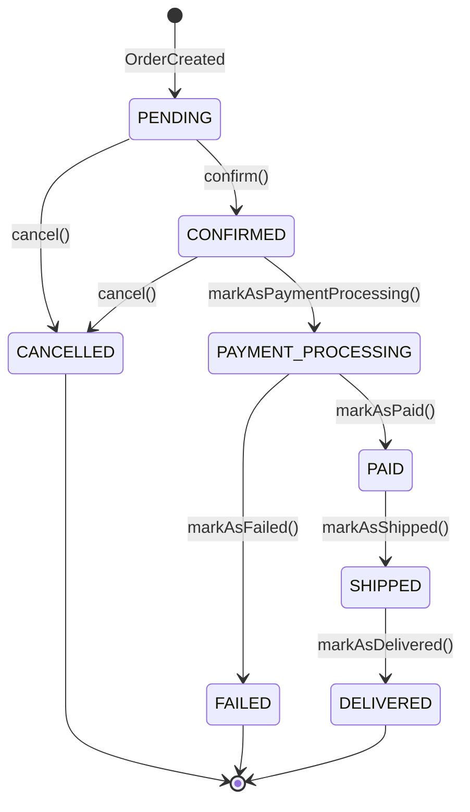
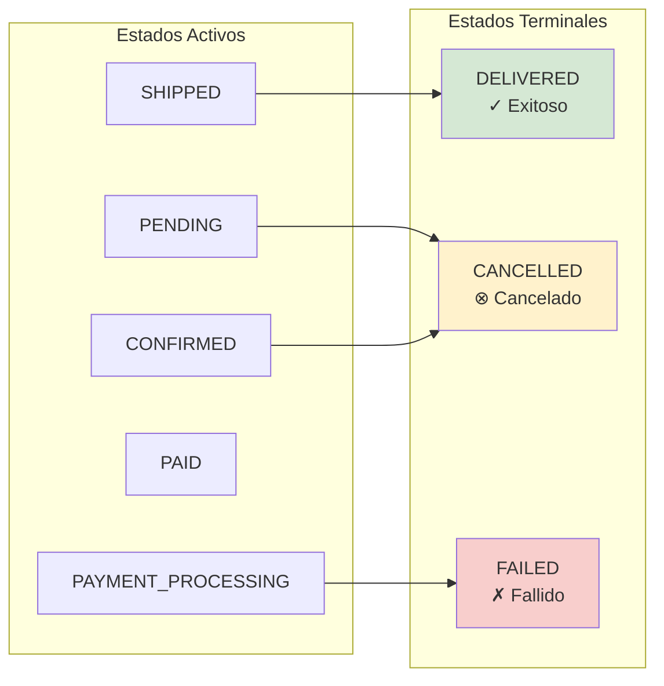

# Diagrama de Máquina de Estados - Order

Este es uno de los documentos más importantes del sistema. La máquina de estados define TODAS las transiciones válidas de una orden. Si no está aquí, no es válido. Punto.

He visto sistemas donde los estados son un caos - se puede ir de cualquier estado a cualquier otro dependiendo de quién escribió ese endpoint. Esto previene ese caos. Las transiciones están definidas explícitamente en código (ver OrderStatus enum en domain-model-design.md).

## Máquina de Estados Completa



---

## Descripción de Estados

Voy a detallar cada estado porque es importante entender QUÉ significa estar en cada uno, QUÉ se puede hacer, y QUÉ eventos lo disparan.

### PENDING
**Descripción:** Orden recién creada, esperando confirmación y validación de inventario.

**Características:**
- Estado inicial de toda orden
- Inventario aún no reservado (podríamos implementar reserva temporal aquí, pero no lo hacemos aún)
- Pago no iniciado
- Puede ser cancelada sin compensaciones (no hay nada que deshacer)

**Transiciones permitidas:**
- → CONFIRMED (confirm)
- → CANCELLED (cancel)

**Eventos que generan entrada:**
- OrderCreatedEvent (cuando el usuario hace POST /api/v1/orders)

**Eventos que genera:**
- OrderConfirmedEvent (al confirmar)
- OrderCancelledEvent (al cancelar)

**Tiempo típico en este estado:** < 5 minutos. Si una orden está en PENDING por más de 30 minutos, algo está mal (ver sección de timeouts al final).

---

### CONFIRMED
**Descripción:** Orden confirmada, inventario reservado, lista para procesar pago.

**Características:**
- Inventario reservado (lógicamente)
- Lista para iniciar pago
- Última oportunidad de cancelación sin reembolso

**Transiciones permitidas:**
- → PAYMENT_PROCESSING (markAsPaymentProcessing)
- → CANCELLED (cancel)

**Eventos que generan entrada:**
- OrderConfirmedEvent

**Eventos que genera:**
- OrderCancelledEvent (si se cancela)

---

### PAYMENT_PROCESSING
**Descripción:** Pago en proceso con gateway externo.

**Características:**
- Comunicación activa con Payment Service
- No puede cancelarse (ya en proceso, necesitarías reembolso)
- Estado temporal (debe resolverse rápido)

**Transiciones permitidas:**
- → PAID (markAsPaid)
- → FAILED (markAsFailed)

**Eventos que generan entrada:**
- PaymentProcessedEvent → PAID
- PaymentFailedEvent → FAILED

**Tiempo esperado en estado:** < 30 segundos típicamente.

**Importante:** Este es el estado más crítico. Si una orden se queda aquí por más de 2 minutos, hay un problema serio. O el payment gateway está caído, o hay un bug en el consumer. Alertamos en este caso (ver ADR-003 sobre timeouts).

---

### PAID
**Descripción:** Pago exitoso, orden lista para preparación y envío.

**Características:**
- Pago cobrado exitosamente
- No reversible (requiere refund si se cancela desde aquí)
- Cliente ha sido notificado del pago exitoso

**Transiciones permitidas:**
- → SHIPPED (markAsShipped)

**Eventos que generan entrada:**
- OrderPaidEvent

**Eventos que genera:**
- OrderShippedEvent (cuando se envía)

---

### SHIPPED
**Descripción:** Orden enviada al cliente, en tránsito.

**Características:**
- Paquete físico en ruta
- Tracking number disponible
- Cliente notificado con información de envío

**Transiciones permitidas:**
- → DELIVERED (markAsDelivered)

**Eventos que generan entrada:**
- OrderShippedEvent

**Eventos que genera:**
- OrderDeliveredEvent (cuando se confirma entrega)

---

### DELIVERED
**Descripción:** Orden entregada exitosamente al cliente. **Estado Terminal.**

**Características:**
- Flujo completado exitosamente
- Cliente confirmó recepción
- No hay más transiciones posibles

**Transiciones permitidas:**
- Ninguna (estado terminal)

**Eventos que generan entrada:**
- OrderDeliveredEvent

---

### CANCELLED
**Descripción:** Orden cancelada por cliente o sistema. **Estado Terminal.**

**Características:**
- Inventario liberado
- Si había pago, se inició reembolso
- Cliente notificado

**Transiciones permitidas:**
- Ninguna (estado terminal)

**Eventos que generan entrada:**
- OrderCancelledEvent

**Razones comunes:**
- Cliente canceló manualmente (PATCH /orders/{id}/cancel)
- Pago falló (compensación automática vía Saga)
- Sin stock disponible
- Timeout esperando confirmación

**Nota sobre "reabrir" órdenes:** No puedes reabrir una orden cancelada. Si el cliente quiere comprar de nuevo, crea una NUEVA orden. Esto mantiene la auditoría limpia y evita estados inconsistentes.

---

### FAILED
**Descripción:** Error irrecuperable en procesamiento. **Estado Terminal.**

**Características:**
- Error técnico o de negocio sin recuperación
- Requiere creación de nueva orden
- Compensaciones ejecutadas si aplica

**Transiciones permitidas:**
- Ninguna (estado terminal)

**Eventos que generan entrada:**
- OrderFailedEvent

**Razones comunes:**
- Múltiples fallos de pago (después de 5 reintentos, por ejemplo)
- Error en gateway externo (irrecuperable)
- Datos inválidos irrecuperables
- Timeout en proceso crítico

**Diferencia con CANCELLED:**

CANCELLED es esperado y normal (usuario cambia de opinión, pago rechazado por fondos). FAILED es anormal - indica un problema técnico o bug.

Si ves muchas órdenes en FAILED, investiga. No es comportamiento normal del sistema.

---

## Tabla de Transiciones

| Estado Actual | Acción | Estado Siguiente | Evento Publicado |
|---------------|--------|------------------|------------------|
| PENDING | confirm() | CONFIRMED | OrderConfirmedEvent |
| PENDING | cancel() | CANCELLED | OrderCancelledEvent |
| CONFIRMED | markAsPaymentProcessing() | PAYMENT_PROCESSING | - |
| CONFIRMED | cancel() | CANCELLED | OrderCancelledEvent |
| PAYMENT_PROCESSING | markAsPaid(paymentId) | PAID | OrderPaidEvent |
| PAYMENT_PROCESSING | markAsFailed(reason) | FAILED | OrderFailedEvent |
| PAID | markAsShipped() | SHIPPED | OrderShippedEvent |
| SHIPPED | markAsDelivered() | DELIVERED | OrderDeliveredEvent |

---

## Validaciones de Transiciones

Este código es CRÍTICO. Es la implementación de la máquina de estados. Lo ponemos directamente en el enum OrderStatus (capa de dominio) porque es lógica de negocio pura.

Antes de hacer cualquier transición de estado, llamamos `canTransitionTo()`. Si devuelve false, lanzamos `InvalidOrderStateException`. Esto previene transiciones inválidas a nivel de código.

```java
public enum OrderStatus {
    PENDING,
    CONFIRMED,
    PAYMENT_PROCESSING,
    PAID,
    SHIPPED,
    DELIVERED,
    CANCELLED,
    FAILED;

    public boolean canTransitionTo(OrderStatus newStatus) {
        return switch (this) {
            case PENDING -> newStatus == CONFIRMED || newStatus == CANCELLED;
            case CONFIRMED -> newStatus == PAYMENT_PROCESSING || newStatus == CANCELLED;
            case PAYMENT_PROCESSING -> newStatus == PAID || newStatus == FAILED;
            case PAID -> newStatus == SHIPPED;
            case SHIPPED -> newStatus == DELIVERED;
            case DELIVERED, CANCELLED, FAILED -> false; // Terminales
        };
    }

    public boolean isTerminal() {
        return this == DELIVERED || this == CANCELLED || this == FAILED;
    }

    public boolean canBeCancelled() {
        return this == PENDING || this == CONFIRMED;
    }
}
```

---

## Flujos Completos por Escenario

Aquí muestro los flujos end-to-end más comunes. En producción verás combinaciones de estos, pero entender cada uno por separado ayuda.

### Escenario 1: Happy Path (Exitoso)

```
PENDING → CONFIRMED → PAYMENT_PROCESSING → PAID → SHIPPED → DELIVERED
```

**Tiempo estimado:** 2-5 días (mayoría del tiempo esperando preparación y envío físico)
**Eventos generados:** 6 eventos (OrderCreated, OrderConfirmed, OrderPaid, OrderShipped, OrderDelivered, + eventos de Payment y Notifications)

Este es el flujo que queremos optimizar. Debe ser fluido, rápido, sin fricciones.

---

### Escenario 2: Cancelación Temprana

```
PENDING → CANCELLED
```

**Tiempo estimado:** Inmediato
**Eventos generados:** 2 eventos (OrderCreated, OrderCancelled)
**Compensaciones:** Ninguna (aún no hay pago)

---

### Escenario 3: Cancelación Después de Confirmación

```
PENDING → CONFIRMED → CANCELLED
```

**Tiempo estimado:** Minutos
**Eventos generados:** 3 eventos
**Compensaciones:** Liberar inventario reservado

---

### Escenario 4: Pago Falla

```
PENDING → CONFIRMED → PAYMENT_PROCESSING → FAILED
```

**Tiempo estimado:** < 1 minuto
**Eventos generados:** 3 eventos (OrderCreated, PaymentFailed, OrderFailed)
**Compensaciones:** Liberar inventario, notificar usuario

Este flujo activa nuestra Saga de compensación (ver ADR-003). PaymentFailed dispara OrderFailed, que dispara liberación de inventario y notificación al usuario.

---

## Estados Terminales - No Reversibles



---

## Tiempos Esperados por Estado

Estos timeouts son importantes. Nos dicen cuándo algo está mal y necesitamos intervenir.

| Estado | Tiempo Esperado | Timeout Alert |
|--------|----------------|---------------|
| PENDING | < 5 minutos | > 30 minutos |
| CONFIRMED | < 2 minutos | > 15 minutos |
| PAYMENT_PROCESSING | < 30 segundos | > 2 minutos |
| PAID | 1-2 días (prep) | > 5 días |
| SHIPPED | 2-5 días (envío) | > 10 días |
| DELIVERED | Terminal | N/A |
| CANCELLED | Terminal | N/A |
| FAILED | Terminal | N/A |

**Nota:** Los timeouts generan alertas para intervención manual. Órdenes "atascadas" en estados no terminales requieren investigación.

**Por qué estos números:**

Los tiempos no son arbitrarios. Vienen de observar el flujo real:
- PENDING/CONFIRMED son automáticos, deberían ser instantáneos
- PAYMENT_PROCESSING depende del gateway externo, pero < 30s es razonable
- PAID depende de preparación física, 1-2 días es típico
- SHIPPED depende de logística, 2-5 días típico en Colombia

Si superas los timeouts de alerta, algo anormal está pasando. Investiga.

---

## Auditoría de Cambios de Estado

Cada transición de estado se registra en MongoDB (nuestro event store) con:

```json
{
  "orderId": "order-123",
  "fromStatus": "PENDING",
  "toStatus": "CONFIRMED",
  "timestamp": "2025-01-19T10:30:00Z",
  "triggeredBy": "system",
  "eventId": "event-uuid",
  "metadata": {
    "reason": "Inventory validated",
    "correlationId": "correlation-uuid"
  }
}
```

**Por qué esto es valioso:**

He usado esta auditoría en producción más veces de las que puedo contar. Ejemplos reales:
- "Por qué esta orden se canceló?" → Miras la auditoría, ves PENDING → CANCELLED con reason: "Payment failed: insufficient funds"
- "Cuánto tiempo tomó procesar el pago?" → timestamp(PAID) - timestamp(PAYMENT_PROCESSING) = 12 segundos
- "Esta orden estuvo en PENDING por 3 horas, por qué?" → Ves que no hay transición a CONFIRMED, algo bloqueó el flujo

Esto permite:
- Auditoría completa de cambios
- Debugging de problemas (esto solo vale el costo)
- Análisis de tiempos por estado (optimización de procesos)
- Reconstrucción del historial de una orden (compliance/legal)

---

## Métricas de Estado

Estas métricas son las que debes monitorear en producción. No son "nice to have", son necesarias.

**Dashboards recomendados:**

1. **Distribución de estados** (pie chart)
   - Cuántas órdenes en cada estado actualmente
   - Te dice de un vistazo si hay algo anormal (ej: 500 órdenes en PAYMENT_PROCESSING es raro)

2. **Tiempo promedio por estado** (bar chart)
   - Detectar cuellos de botella
   - Si PAYMENT_PROCESSING promedia 2 minutos, el payment gateway está lento

3. **Tasa de conversión por estado** (funnel)
   ```
   PENDING: 100%
   CONFIRMED: 95%
   PAYMENT_PROCESSING: 94%
   PAID: 92%
   SHIPPED: 91%
   DELIVERED: 90%
   ```
   Estos números son ejemplo. Los tuyos variarán. Lo importante es detectar caídas: si normalmente 95% de PENDING llega a CONFIRMED y de repente baja a 70%, algo está mal.

4. **Tasa de cancelación/fallo**
   - CANCELLED rate: objetivo < 5% (depende del negocio)
   - FAILED rate: objetivo < 3% (esto debe ser MUY bajo, representa errores técnicos)

5. **Órdenes atascadas** (alert)
   - Órdenes que exceden tiempo esperado en estado
   - Esto debe generar alerta P1 o P2 dependiendo del estado

**Una nota sobre métricas:**

No es para obsesionarse con números. Es para detectar problemas antes de que exploten. Un dashboard bien hecho te avisa cuando algo está mal ANTES de que los usuarios empiecen a quejarse.
